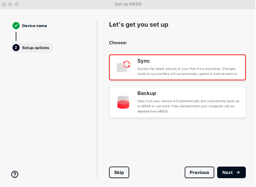

# Zotero + MEGA Setup Guide

## Goal
Set up Zotero for **free reference management** + MEGA for **encrypted PDF storage (20–25 GB free)**.  

This workflow gives:  
- Metadata sync via Zotero (titles, authors, DOIs, etc.).  
- 20–25 GB secure PDF sync via MEGA versus the original Zotero 300 MB limit.  
- Cross-device access.

Summary:
Using MEGA with Zotero is a way to bypass Zotero’s limited free storage (300 MB) while keeping your entire library of PDFs synced securely across devices. The positives: you get 20–25 GB of free encrypted storage compared to 300 MB, your metadata still syncs seamlessly through Zotero, and you retain control over your files. The negatives: attaching PDFs requires a bit more manual effort (always linking to MEGA, not storing in Zotero’s hidden folder), and if you save via the browser connector, you must re-link the file to MEGA. Overall, it’s a flexible, privacy-friendly solution but less “automatic” than Zotero’s built-in storage.

---

## 1. Create Accounts
- [Zotero](https://www.zotero.org) --> reference management (metadata, citations).  
- [MEGA](https://mega.io) --> secure storage for PDFs.  

   Note: Using a **personal email account** instead of work/university email account will ensure you have access to everyting even if you leave your current position or lose access to your work/university email. 

   Note: MEGA accounts are encrypted so you cannot easily recover your password, **PLEASE SAVE YOUR MEGA RECOVERY KEY**. 

---

## 2. Install Software
- [Zotero Desktop](https://www.zotero.org/download/)  
- Zotero Connector (browser extension for Chrome/Firefox)  
- [MEGA Desktop App](https://mega.io/desktop)  

---

## 3. Set Up MEGA
1. During MEGA setup, choose **Sync** (not Backup).  
   - *Sync* keeps local & cloud folders identical.  
   - *Backup* only uploads one-way.  

2. Pick a local folder (example):  

    ```bash
    ~/MEGA
    ```

   Note: You can point to a MEGA/Zotero directory direclty, if you plan to only use MEGA for Zotero. Not recommended. 
   
3. Click NEXT, then DONE

4. Inside the MEGA directory on your machine, create a subfolder for your Zotero PDFs:  

   ```bash
   ~/MEGA/ZoteroStorage
   ```
   <br><br>
   
   <br><br>
   
   <br><br>
   


---

## 4. Configure Zotero Sync  
Login to Zotero

Open **Zotero --> Settings --> Sync**:  
- Sync automatically  --> CHECK
- Sync full-text content  --> CHECK
- *Uncheck* both "Sync attachment files" boxes  

 Note: This ensures Zotero syncs only **metadata** while PDFs stay in MEGA.  

   <br><br>
   
   <br><br>
   

---

## 5. Point Zotero to MEGA  
Zotero --> **Settings --> Advanced --> Files and Folders**:  
- Under **Linked Attachment Base Directory**, set:  

   ```bash
   ~/MEGA/ZoteroStorage
   ```

Note: This tells Zotero that all linked files live in MEGA.  
Note: Do **not** change "Data Directory Location" (leave it in `~/Zotero`). That’s where Zotero stores its database, not PDFs.  

   <br><br>
   

---

## 6. Adding PDFs & References to Zotero via MEGA

### 6A. Adding PDFs from MEGA via Zotero interface  
This method is cleanest when you already downloaded a PDF yourself.  

1. Save PDFs directly into:  

   ```bash
   ~/MEGA/ZoteroStorage/[YourCollectionName]/
   ```

2. In Zotero:  
   - Click **Add Attachment --> Add Link to File…**.  
   - Choose the PDF from MEGA.  (You can select multiple papers at a time! Recommended!)

3. Verify:  
   - Right-click the PDF in Zotero --> **Show in Finder (or equivalent)**.  
   - Path should contain `MEGA/ZoteroStorage`, not `Zotero/storage`.  

4. Zotero will auto-fetch metadata (title, author, DOI, etc.) or you can add manually.  

   <br><br>

   

   <br><br>

   


### 6B. Adding PDFs from your web browser via Zotero Connector (more complicated - not recommended)

Note: This method is faster when grabbing papers directly online, but requires a fix since Zotero defaults to its own storage.

#### Step 1. Save paper via Connector
1. On an article page, click the Zotero Connector icon.  
2. Choose a Zotero collection.  
3. Zotero saves metadata + PDF (but into hidden `~/Zotero/storage/...`).  This will be changed later. 

#### Step 2. Move PDF into MEGA  
1. In Zotero, right-click the PDF --> **Show in Finder (or equivalent)**.  
2. Move the pdf manually into the proper MEGA directory:  

```bash
~/MEGA/ZoteroStorage/[YourCollectionName]/
```

#### Step 3. Re-link the PDF from MEGA to Zotero
1. Back in Zotero, right-click old PDF (PDF, not the title)--> **Move Item to Trash**.  
2. Right-click the parent item (title) --> **Add Attachment --> Linked File**.  
3. Select the PDF from MEGA.  

#### Step 4. Verify  
- Right-click PDF --> **Show in Finder (or equivalent)**.  
- Confirm path points to `MEGA/ZoteroStorage`.  

   <br><br>
   

---

## 7. Verify Everything Works
- Metadata should sync across devices via Zotero.  
- PDFs should sync via MEGA.  
- Right-click any paper --> **Show in Finder (or equivalent)** --> path must always be in MEGA.  

---

## Overall
- Always choose Add Link to File (not Add File) - you can upload many papers at a time.  
- Zotero Connector = best for quick metadata grab. Just remember to re-link the PDF to MEGA. (Tedious)
- MEGA = 20-25 GB free, expandable via referrals or paid plans. Roughly 15k–25k papers depending on size.  

## Other
- If you notice any issues in the tutorial or have updates to suggest, please feel free to reach out or submit a pull request. Thank you!
